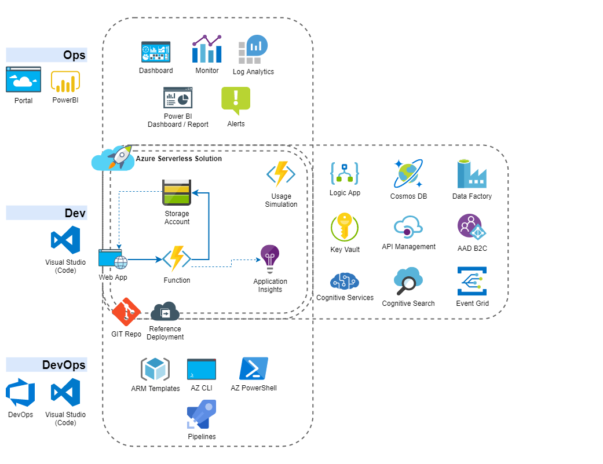

# Overview
This repository contains a basic "Azure Serverless Application" as a basis for the implementation of additional functionality. The purpose of this is education.

> For documentation of Azure services, architecture patterns and other theory material consider Microsoft sites. A recommandation: [Serverless apps: Architecture, patterns, and Azure implementation](https://docs.microsoft.com/de-de/dotnet/architecture/serverless).
> [Microsoft Learn](https://docs.microsoft.com/en-us/learn/azure/) platform contains plenty of high-quality tutorials which are very much recommended. Specifically there is a Learning Path ["Create serverless applications"](https://docs.microsoft.com/de-de/learn/paths/create-serverless-applications/).

Providing customers with a solution based on Azure Services at a professional level, requires competencies of: Development, provisioning and operational management. These 3 pillars are equally important and relevant in all phases of an implementation project. This lab contains challenges for those pillars which are inspired by real world situations and requirements.

# General Preparations
You need to have your own Azure subscription to work with this lab. As a GARAIO employee you have these two possibilities:
- MSDN Subscription: Go to http://my.visualstudio.com/benefits
- Voucher: Ask :-)

By default, the MSDN-based subscription is tied to the organisation tenant. You can transfer it to a private account to not pollute the organisations AD with e.g. App Registrations (ask for guidance).

# Demo Application
Coming soon.

# Tracks
## Dev
Extend the basic application with additional functionality.

* [Preparation](./Track-Dev/Preparation.md)
* [Challenges](./Track-Dev/Challenges.md)

## DevOps
Implement an "Infrastructure as Code" solution which enables the deployment to new or existing environments. Additionally you may implement a CI/CD strategy with Azure Pipelines.

* [Preparation](./Track-DevOps/Preparation.md)
* [Challenges](./Track-DevOps/Challenges.md)

## Ops
Provide possibilities to visualize operational key aspects of the application. Enable business insights as well as the detection and notification of technical problems and possible optimizations.

* [Preparation](./Track-Ops/Preparation.md)
* [Challenges](./Track-Ops/Challenges.md)

# Solutions
Feel free to share your work. Please follow these [guidelines](./Solutions/Guidelines.md).
