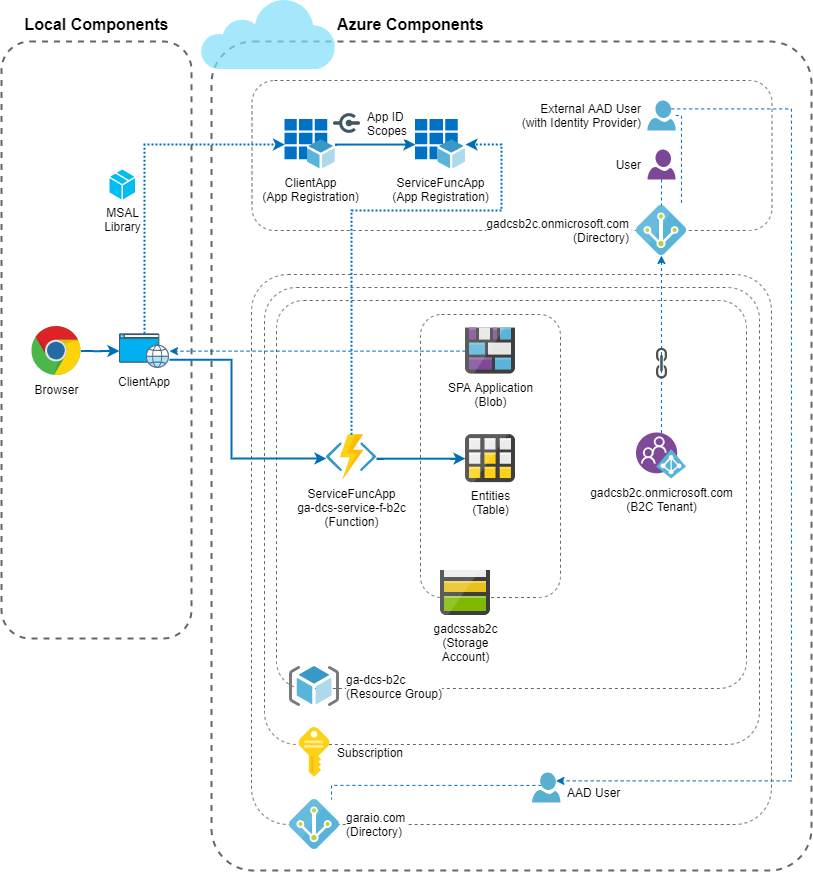
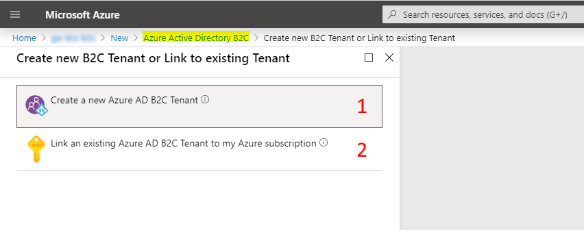
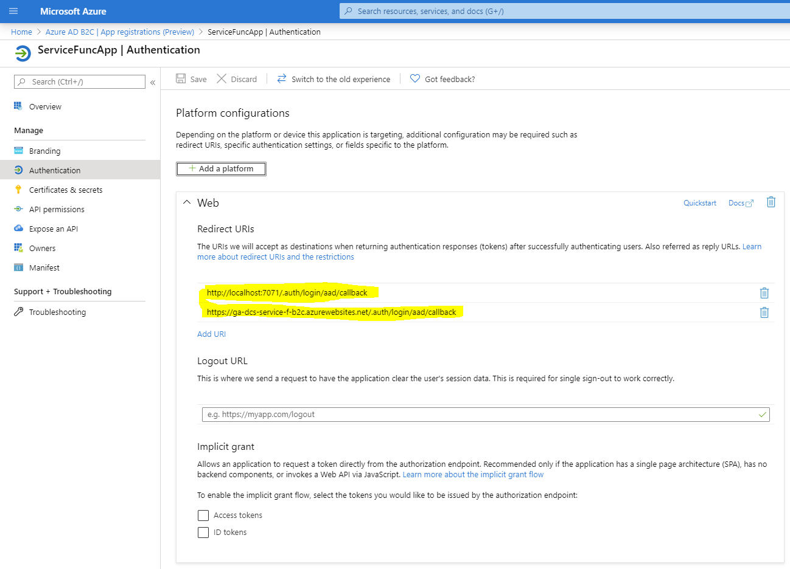
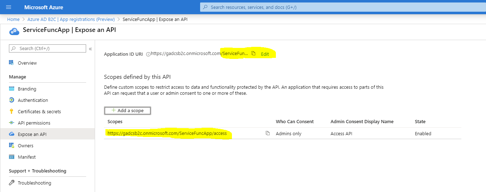
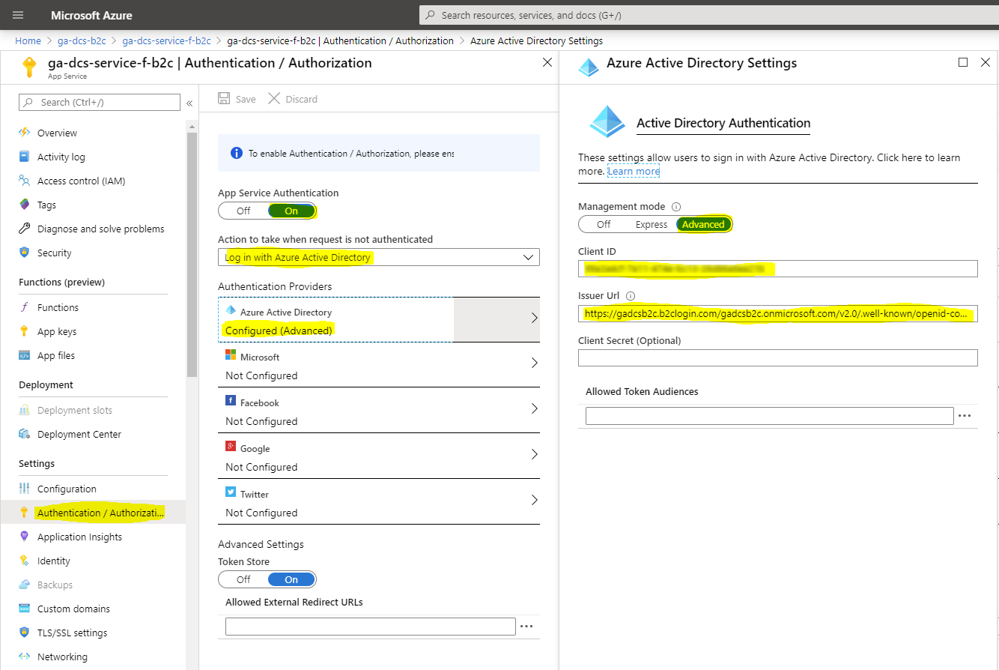
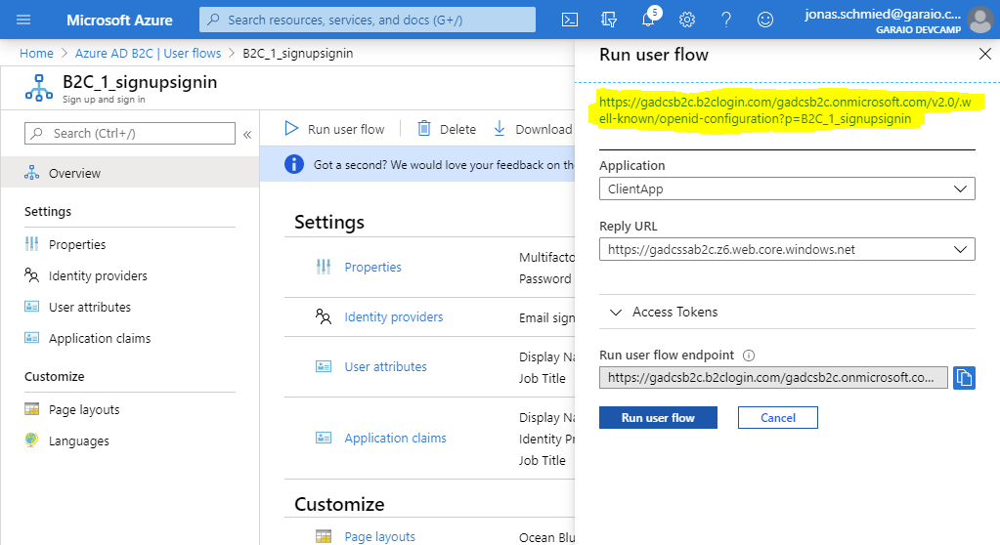
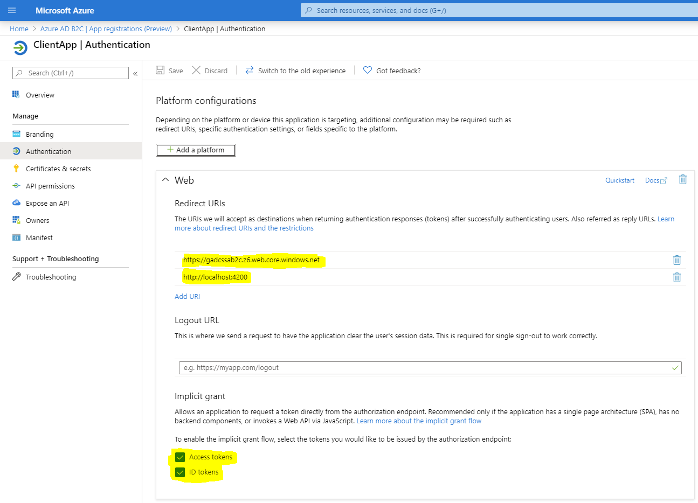
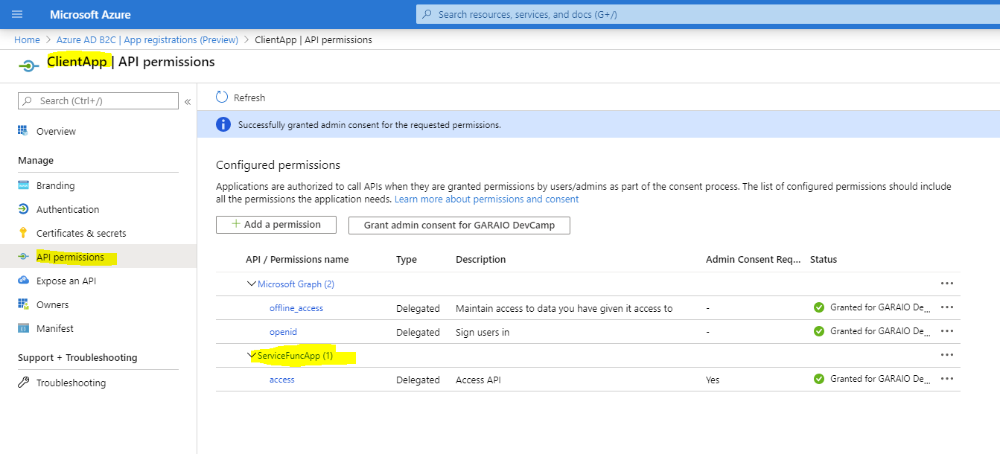
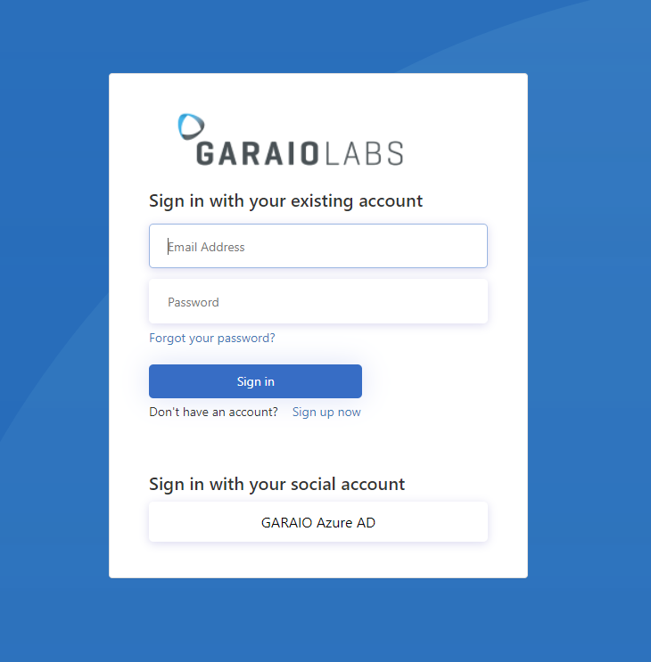
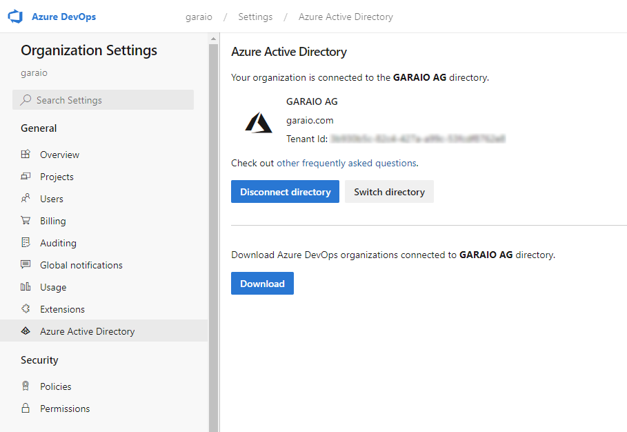

# Summary
The Azure Active Directory B2C (AAD B2C) promises a simple protection of all involved Azure services with a simple user management. As it turns out, the setup of such a solution is a bit complicated and may end up in painful experience. Overall the integration-methods and libraries are sort of unstable and half-baken and it is hard to find useful documentation as there are many problems to be solved and thus the tutorials always are incomplete. Also there is a constant change in the way configurations in Azure services look like, so many stuff Google spooks out is hardly understandable or just obsolete.
The architecture with an Angular SPA (directly from a Storage Account or via a CDN) and a related Azure Function (potentially provisioned with API management) looks like one of the most typical blueprints nowadays - there is no obvious reason why this is not better supported by Microsoft. Anyway, this readme shall fill this gap and provide the relevant knowledge and guideline to configure a working solution.

# Knowledge
It is important to understand the basic structure and mechanism used to authenticate and autorize a user.



* An AAD B2C instance is a separate directory beside the current directory containing the subscription with the application components. To access it, it consequently needs you to switch the directory in your Azure Portal's user profile.
* After that intial step, you link the Azure B2C tenant with your subscription which is materialized with a new Azure resource of type "B2C Tenant" created in the same Resource Group (or another if you want).
* Every component involved in the authorization context needs its own App Registration (maybe it would work otherwise, but it seems to be the cleanest way). The "forwarding" of the user context from one component to another (i.e. from the SPA to the Azure Function) is done with a pretty cool concept: The target App Registration exposes an "API" (consisting of an Application ID and one or multiple scopes) which can added in the using App Registrations as API permission. So this works the same way as the application would access a standard API like Microsoft Graph. When the user authenticates with the App Registration for the ClientApp (SPA) and grants the requested permissions, then this token can be used to access the ServiceFuncApp (API within the Azure Function).

# Integrations / Adjustments to provided basis
Just follow the steps in this chapter sequentially.

## AAD B2C (basic setup)
1. Create the directory and then the link to it:

[Tutorial on MSDN](https://docs.microsoft.com/en-us/azure/active-directory-b2c/tutorial-create-tenant)

1. Create user flows:
[Tutorial on MSDN](https://docs.microsoft.com/en-us/azure/active-directory-b2c/tutorial-create-user-flows)

1. Link your AAD organisation (i.e. register tenant):
[Tutorial on MSDN](https://docs.microsoft.com/en-us/azure/active-directory-b2c/identity-provider-azure-ad-single-tenant)
/
[Tutorial on Medium](https://medium.com/the-new-control-plane/connecting-azure-ad-b2c-to-azure-ad-via-the-b2c-custom-identity-provider-42fbc2832e32)

1. Update the user flow with new tenant:
[Tutorial on MSDN](https://docs.microsoft.com/en-us/azure/active-directory-b2c/tutorial-add-identity-providers#update-the-user-flow)

1. Create a user for testing

## Service Function App (API)
1. App Registration in AAD B2C:

Keep default values of other configurations. Implicit grants and client secrets are not needed.

1. Extend App Registration with Application ID and a Scope:

_You could define multiple scopes, but this only makes sense if you have multiple client applications with different user segments._

1. Configure authentication on the Function:

  Important points:
    - Client ID = Application ID from App Registration
    - Issuer URL = Go to AAD B2C > User Flows > Sign up and sign in > Button "Run user flow" > Copy URL displayed at the top


1. Adjust / extend code in UserProfile function: The authentication token is provided as ClaimsPrincipal which provides all user information as single claims. Example how to read these information: [UserProfile.cs](./Source/Garaio.DevCampServerless.ServiceFuncApp/UserProfile.cs)

Additional resources (partly adaptable):
* https://blogs.msdn.microsoft.com/hmahrt/2017/03/07/azure-active-directory-b2c-and-azure-functions
* https://westerndevs.com/Functions-aad-authentication

## Client App (Demo UI)
1. App Registration in AAD B2C:

Keep default values of other configurations. Client secrets are not needed.

1. Link Service Function App by granting API permission:


1. To connect to AAD (regular or B2C) from JavaScript applications, Microsoft provides the "[Microsoft Authentication Library (MSAL)](https://github.com/AzureAD/microsoft-authentication-library-for-js)". Even better, [for Angular there is a more specialized version available](https://github.com/AzureAD/microsoft-authentication-library-for-js/blob/dev/lib/msal-angular) which simplifies integration and usage. After configuration this provides these main functionalities:
   * Automatic authentication and protection of single route endpoints with an Angular Guard
   * Auto-injection of the token into HTTP calls with an Angular Interceptor

   You may adapt the necessary configuration from the source in this directory. Additional resources (partly adaptable):
   * [Documentation of MSAL for Angular (data structure for configuration is not actual at the time of writing)](https://github.com/AzureAD/microsoft-authentication-library-for-js/blob/dev/lib/msal-angular/README.md)
   * [Official MSAL/Angular Sample App](https://github.com/Azure-Samples/active-directory-javascript-singlepageapp-angular) / [Other Samples](https://github.com/AzureAD/microsoft-authentication-library-for-js/tree/dev-angular-1.0/samples)
   * [Helpful Tutorial](https://medium.com/@ashprosser/building-an-adb2c-angular-app-with-azure-msal-angular-52ec92e5572)
   * Important hint: **The authority is not the same as the Issuer URL used in the configuration of the Service Function App**. You need to manually define it using this pattern: 'https://{AAD B2C resource-name}.b2clogin.com/{AAD B2C resource-name}.onmicrosoft.com/{Name of User Flow for sign-in/up}'

   
   
   


Following these steps should allow the Angualar application to authenticate the user on defined routes, generate an access-token for the Service Function and automatically inject it to all API calls. The service function can then read the claim values from the token and deliver user information back to the client.


## Tuning / Customizations
### Client App Implementation
The MSAL library is still in preview state at time of writing and has several flaws. The implementation of this (working) example took several hours and it was done to explore best practices for real world solutions. The main learnings are:
* There is no included support for "Password Reset" functionality. There are workarounds like using a  deprected user flow (which directly includes it) or providing a UI-customization in the user flow definition which sets the "Reset" link to the right AAD B2C url. The provided implementation reacts on according information and then triggers the user flow - this seems to be the most clean and stable approach. So it is consistent to the functionality which may be provided in the application to change the password for authenticated accounts (as well as any other profile information).
* The "popup" modus is not consistently possible. For the signup / signin it can be implemented with some hacks, but it wasn't possible to find a way for the reset password flow (method exists but has unresolvable errors). Hacks you need to do to get the first working:
  * Cancellation by closing the dialog -> reopen if not raised by Guard
  * Some errors are raised mutliple times (e.g. "password forgotten") -> use flag-variables to not fall into loops
  * Popup blocking by Browsers (not just IE) -> provide according information or switch to the redirection modus in case of according error
* Therefore consider to consistently implement redirection flows for signup/signin and password reset. This has the disadvantage that you cannot rely on the application state as it is always completely reloaded. The workaround for that is to read the local/session storage of the Browser to find out what happened and what to do next.
* Generally the lib provides poor support to access data in the cache and for error handling. Means you have to extensively do text comparisons and check for magic error codes. And then hope this never changes unexpectedly.
* Obviously using just the guard on (all) routes is not sufficient as for the very initial call the login is not properly triggered and the route is still established (maybe it is releated to the redirect functionality in the Angular routing definition). The implemented solution reacts on errors occuring on implicit token acquire failures and then automatically start the login flow.
* There are some known issues regarding the internal implementation with (hidden) iframes. [This blog-post](https://medium.com/@ashprosser/building-an-adb2c-angular-app-with-azure-msal-angular-52ec92e5572) especially mentions NGRX effects which may somehow conflict. In current implementation the proposed workaround with an additional app-module did not work, but with the solution from the "official" sample (detect if running as iframe and the suppress loading of content in router outlet) no problems occured.

Extract of `app.component.ts`:
```typescript
ngOnInit(): void {
    this.isIframe = window !== window.parent && !window.opener;

    this.checkAccount();

    this.authSvcSub.add(this.broadcastService.subscribe('msal:loginSuccess', () => {
      this.checkAccount();
    }));
    this.authSvcSub.add(this.broadcastService.subscribe('msal:loginFailure', (error: any) => {
      this.handleAuthError(error);
    }));
    this.authSvcSub.add(this.broadcastService.subscribe('msal:acquireTokenFailure', (error: any) => {
      this.handleAuthError(error);
    }));
  }

  ngOnDestroy() {
    if (this.authSvcSub) {
      this.authSvcSub.unsubscribe();
    }
  }

  checkAccount() {
    this.loggedIn = !!this.authService.getUser();
  }

  handleAuthError(error: any) {
    if (!this.authService) {
      return;
    }

    const storage = this.authService.getCacheStorage();
    const authError: string = storage.getItem('msal.login.error');

    if ((authError && authError.indexOf('AADB2C90118') > -1) ||
        (error && error.errorDesc && error.errorDesc.indexOf('AADB2C90118') !== -1)) {
      console.log('Reset Password requested');
      this.startResetPasswordFlow();
    } else if (error && error.error === 'popup_window_error' && error.errorDesc && error.errorDesc.startsWith('Error opening popup window')) {
      this.authService.loginRedirect();
    } else if (this.authService.loginInProgress() === true) {
      console.log('Login is in progress');
    } else if (error && error.error === 'user_login_error' && error.errorDesc && error.errorDesc.startsWith('User login is required')) {
      this.authService.loginRedirect();
    } else if (error && error.error === 'user_cancelled') {
      this.authService.loginRedirect();
    } else {
      console.log(error);
      this.router.navigate(['error']);
    }
  }

  startResetPasswordFlow() {
    const resetAuthService = new UserAgentApplication({
      auth: {
        clientId: environment.authClientId,
        authority: environment.authResetAuthority,
        validateAuthority: false,
        redirectUri: environment.authRedirectUri,
        navigateToLoginRequestUrl: true
      }
    });

    resetAuthService.handleRedirectCallback((authErr: AuthError, _response?: AuthResponse) => {
      if (authErr === null) {
        console.log('Reset Password Successful');
      } else {
        console.log(authErr);
      }

      this.authService.loginRedirect();
    });

    resetAuthService.loginRedirect();
  }
```

### User Experience
The user flows allows basically following standard customizations:
* Languages / localization: There seems not to be an official/regular way how to provide the user's language with the MSAL library. [Microsoft Docs](https://docs.microsoft.com/en-us/azure/active-directory-b2c/user-flow-language-customization) desribe that if the locale is not provided as URL parameter, then the Browsers default language is taken. This did not work with current implemnentation so localizations seems not to be easily possible.
* UI Customization in flows (sign-up/in, password reset) and profile details page (Company Branding) is [well documented in Microsoft Docs](https://docs.microsoft.com/en-us/azure/active-directory-b2c/customize-ui-overview)
* [Multi-factor authentication](https://docs.microsoft.com/en-us/azure/active-directory-b2c/custom-policy-multi-factor-authentication): Not analyzed in deep.

## Integrate API Management (as gateway to the function)
See [Provision Function with API Management including authentication](https://docs.microsoft.com/en-us/azure/api-management/howto-protect-backend-frontend-azure-ad-b2c).

## Custom Policies (Identity Experience Framework)
Some more complex scenarios can be realized with custom policies (the usage and purpose is similar to user flows). There are a lot of (assumingly ready to use) samples on Github: https://github.com/azure-ad-b2c/samples.

Interessing scenarios:
* Non-standard identity providers or advanced account linking
* SMS based instead of Email based account setup (phone number as main identity information)
* Passwordless sign-in with e.g. email validation or sign-in with "magic link"

It is a regular situation that an application shall be provided for all users of an organisation (or at least many of them) without the need to sign-up with a completely new account. This should be followed as a best practise anyway, cause every additional/separate account in an enterprise environment brings in additional management effort and a potential security impact (if an employee leaves the enterprise or changes its role, all access possibilities needs to be checked/removed).
This setup implemented in this solution results in a selection on sign-in as follows. This is not really satisfying for a SaaS application with potentially many AAD providers linked. In such a case, the user should not need to select the provider but just enter his email which selects the provider automatically. It seems that this only can be established using a custom policy.



# Thoughts for multi-tenancy SaaS applications
Lets take Azure DevOps as a reference to concept a multi-tenancy SaaS with linked AAD directories:


The process shall roughly be as follows:
1. A new user signs up with any email account and creates a new organisation
1. He then links the AAD of his company and thus enables all those users to access the organisation content in the app
1. Optionally he may link AAD-groups (dynamically gathered) with application roles
1. Whenever one of those company members signs in, a new user-account is created in the applications AAD B2C and linked with the correct organisation. Optionally group-memberships may be checked and the appropriate roles automatically assigned on each login.
1. The sign-up behavior may be dependent to the ability that a user may be linked with multiple organisations in the app

How can this be established?
Manage the AAD B2C instance with the [operations available in the Graph API](https://docs.microsoft.com/en-us/azure/active-directory-b2c/microsoft-graph-operations). Therewith it should be possible to programatically link/unlink identity providers.
Further documentation with samples: [here](https://docs.microsoft.com/en-us/azure/active-directory-b2c/manage-user-accounts-graph-api)

Further:
Access protected resources on behalf of the user (e.g. Graph) -> Use the MSAL nuget package to generate a token. Example: https://github.com/Azure-Samples/active-directory-dotnet-native-aspnetcore-v2/tree/master/2.%20Web%20API%20now%20calls%20Microsoft%20Graph#reference-msalnet